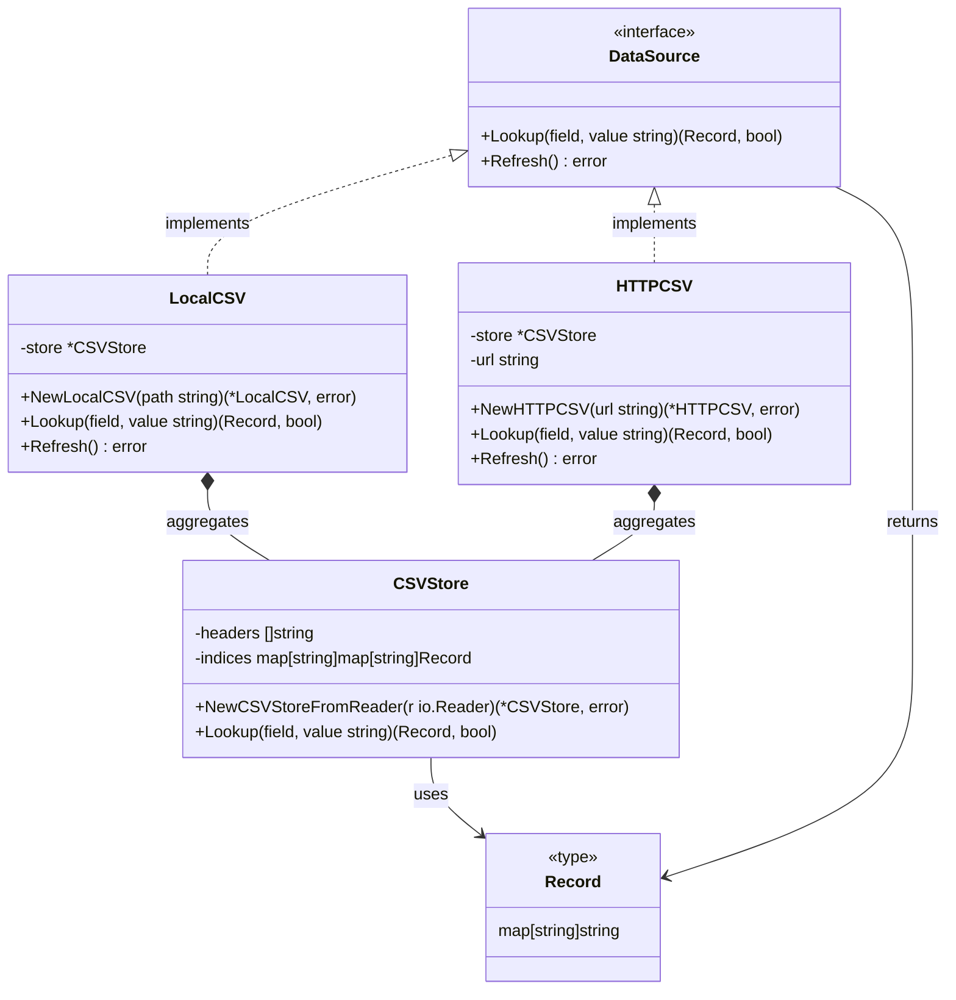

# csvdb

A Go application that provides a simple CSV database-like interface for looking up records. It supports reading CSV data from both local files and HTTP URLs.

## Architecture



## Usage

```go
// Local CSV file
ds, _ := NewLocalCSV("data.csv")
rec, found := ds.Lookup("hostname", "host1.com")

// HTTP CSV source
ds, _ := NewHTTPCSV("https://example.com/data.csv")
rec, found := ds.Lookup("cpus", "4")
```

## Build and Run

```bash
# Build the application
go build -o csvdb

# Run the application
go run .
```